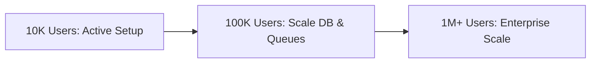

# Production-Grade High-Level Design (HLD) & System Audit — ShrFlow

This document serves as the master architectural specification, security framework, scalability blueprint, and system audit for the **ShrFlow** multi-tenant email operations platform.

---

## 1. System Architecture & Decomposition

ShrFlow is designed around a containerized, asynchronous, decoupled event-driven architecture. The system is split into three core layers: the frontend client, the stateless API gateway, and the distributed worker pool.

### 1.1. Core Services & Directory Layout

*   **Frontend Client (`platform/client`):** Next.js 14 App Router application. Serves as a single page application (SPA) with a hybrid server/client model. Manages workspace scopes via tokenized headers.
*   **Backend API Gateway (`platform/api`):** Asynchronous FastAPI web server running under Uvicorn. Exposes REST APIs, manages social/password authentication, validates JWT tenant contexts, and schedules background tasks.
*   **Asynchronous Workers (`platform/worker`):** Stateless Python workers executing background tasks (CSV parsing, template rendering, and bulk email dispatch).
*   **Distributed Scheduler Service (`platform/worker/scheduler.py`):** Standalone scheduler running as a separate process to poll scheduled campaigns, synchronized across instances using Redis-backed distributed locks (`SET NX PX`).
*   **Global Rate Limiter Service:** Middleware residing inside the API gateway utilizing Redis token buckets to restrict inbound API abuse.

### 1.2. Protocol-Level Interactions

```
[Client App] ───(HTTP REST / WebSockets)───► [FastAPI Gateway]
                                                  │
                            ┌─────────────────────┴─────────────────────┐
                            ▼ AMQP (Events)                             ▼ SQL (asyncpg)
                     [RabbitMQ Broker]                         [Postgres DB]
                            │                                           ▲
                            ▼                                           │
                     [Python Workers] ──────────────────────────────────┘
```

*   **HTTP (REST):** Client-to-API communication. Fully stateless. Leverages short-lived JWTs containing the active `tenant_id` and user permissions.
*   **WebSockets:** Full-duplex connection between the client browser and the API Gateway. Used to broadcast real-time task percentages (e.g., CSV imports) via Redis Pub/Sub.
*   **AMQP (RabbitMQ):** Internal messaging protocol connecting the API gateway to the worker pool. Ensures guarantee-of-delivery even under severe compute node failures.

---

## 2. Message Broker Design

To prevent system-wide lockups and ensure tenant fairness, the message broker uses decoupled routing exchanges, priority queues, and strict dead-letter isolation.

### 2.1. Broker Topology

*   **Exchanges:**
    *   `shrflow.direct`: Routes task-specific jobs (e.g., imports, template compilations).
    *   `shrflow.topic`: Handles routing for event-driven webhooks and state updates.
*   **Queues & Priority Routing:**
    *   `system_emails`: High-priority (Priority 9) queue for OTPs and invitations.
    *   `campaign_emails`: Multi-priority (Priority 0–4) queue for bulk sends.
    *   `import_tasks`: Lower priority queue designed for heavy ingestion workloads.
*   **Dead-Letter Exchanges (DLX):** All queues route failed messages to `dlx.shrflow` with a routing key suffix `.dead`. Messages are kept for manual inspection and debugging.

### 2.2. Retry & Backpressure Strategy
*   **Exponential Backoff:** Failed worker tasks are nacked and requeued using an exponential backoff sequence (e.g., $t \times 2^n$ seconds) up to 3 times, after which they are moved to the DLQ.
*   **QoS Prefetch Limits:** To prevent a single worker node from buffering thousands of messages locally and starving other instances, workers execute `basic_qos(prefetch_count=10)`.

### 2.3. Tenant Flooding & Fairness Guarantees
*   **The Flood Problem:** If Tenant A sends a campaign to 1,000,000 recipients, Tenant B's system OTPs or smaller campaigns could get stuck in the broker queue.
*   **Fairness Mitigation:**
    1.  **Virtual Hosts (Production Scaling):** Run separate RabbitMQ vhosts per plan tier (e.g., `vhost_free`, `vhost_enterprise`).
    2.  **Sharded Campaigns:** Split campaign dispatches into chunked tasks (e.g., batches of 1,000) and stagger queue injection using a Redis rate limiter.

---

## 3. Multi-Tenancy & Security

Multi-tenancy is enforced at the database infrastructure level to guarantee isolation and mitigate data leaks caused by application code vulnerabilities.

### 3.1. PostgreSQL Row-Level Security (RLS) Lifecycle
Every database table (except global system settings) is secured with RLS:
```sql
ALTER TABLE campaigns ENABLE ROW LEVEL SECURITY;

CREATE POLICY tenant_isolation_policy ON campaigns
USING (tenant_id = current_setting('app.current_tenant_id')::uuid)
WITH CHECK (tenant_id = current_setting('app.current_tenant_id')::uuid);
```
1.  **JWT Extraction:** The API gateway decodes the JWT and extracts `tenant_id`.
2.  **Pool Checkout:** The connection manager (`asyncpg`) checks out a connection and immediately runs:
    ```sql
    SET LOCAL app.current_tenant_id = 'tenant-uuid';
    ```
    within the SQL transaction block.
3.  **Scope Verification:** PostgreSQL automatically filters rows. If `app.current_tenant_id` is unset or invalid, zero rows are returned.

### 3.2. Connection Pool Contamination Mitigation
*   **The Risk:** If a connection is returned to the pool without clearing `app.current_tenant_id`, the next request checked out by a different tenant could access the previous tenant's data.
*   **Mitigation:** The connection manager wraps every query execution in a strict transaction scope. The pool utilizes `asyncpg` hooks to execute `RESET ALL` or `DISCARD ALL` upon returning the connection to the pool.

### 3.3. Role-Based Access Control (RBAC) Matrix
Permissions are mapped directly to four tenant-level roles:

| Feature / Action | Owner | Admin | Creator | Viewer |
| :--- | :---: | :---: | :---: | :---: |
| **Workspace Settings & Billing** | ✅ | ❌ | ❌ | ❌ |
| **Delete Workspace** | ✅ | ❌ | ❌ | ❌ |
| **Invite & Manage Members** | ✅ | ✅ | ❌ | ❌ |
| **Export Contacts / Lists** | ✅ | ✅ | ❌ | ❌ |
| **Send/Trigger Campaigns** | ✅ | ✅ | ❌ | ❌ |
| **Create/Edit Templates** | ✅ | ✅ | ✅ | ❌ |
| **View Analytics & Dashboards** | ✅ | ✅ | ✅ | ✅ |

*   **API Enforcement:** Enforced using FastAPI dependency injection (`require_permission("campaign:send")`) validating role hierarchies.
*   **Frontend Enforcement:** Handled via custom React hooks hiding UI control components for lower permission roles.

### 3.4. API Abuse & Rate Limiting
*   **Inbound Protection:** Fast HTTP rate-limiting is implemented via a Redis-backed token bucket algorithm (using `slowapi` or custom middleware).
*   **Endpoint Protection:** Public routes (e.g., signup, login, unsubscribe) enforce strict IP-based and user-agent limits to prevent credential stuffing and denial of service.

---

## 4. Database Design & Scaling

ShrFlow uses a single, shared schema with optimized indexing and partition architectures to handle extreme growth.

### 4.1. Core Table Definitions & Indexing Strategy

```
  ┌─────────────────┐       ┌─────────────────┐       ┌─────────────────┐
  │     tenants     │◄──────┤  tenant_users   ├──────►│      users      │
  │  (Workspace ID) │       │ (Roles mapping) │       │  (Identity ID)  │
  └────────┬────────┘       └─────────────────┘       └─────────────────┘
           │
           ├────────────────────────┬────────────────────────┐
           ▼                        ▼                        ▼
  ┌─────────────────┐      ┌─────────────────┐      ┌─────────────────┐
  │    contacts     │      │    templates    │      │    campaigns    │
  │(Audience emails)│      │  (MJML JSON)    │      │ (Metadata/State)│
  └─────────────────┘      └─────────────────┘      └────────┬────────┘
                                                             │
                                                             ▼
                                                    ┌─────────────────┐
                                                    │  email_events   │
                                                    │ (PARTITIONED)   │
                                                    └─────────────────┘
```

*   **`tenants`:** Tracks global workspaces.
*   **`tenant_users`:** Links users to workspaces with specific roles.
*   **`contacts`:** Stores email addresses, tags, custom fields, and engagement scores.
    *   *Index:* `CREATE UNIQUE INDEX idx_contacts_tenant_email ON contacts(tenant_id, email);` (enforces uniqueness per tenant).
*   **`email_events`:** Stores delivery telemetry (delivered, opened, clicked, bounced).
    *   *Index:* `CREATE INDEX idx_events_search ON email_events(campaign_id, occurred_at);`

### 4.2. Partitioning Strategy
The `email_events` table is range-partitioned monthly by the `occurred_at` timestamp:
```sql
CREATE TABLE email_events (
    id UUID NOT NULL,
    tenant_id UUID NOT NULL,
    campaign_id UUID NOT NULL,
    event_type VARCHAR(50) NOT NULL,
    occurred_at TIMESTAMP NOT NULL,
    PRIMARY KEY (id, occurred_at)
) PARTITION BY RANGE (occurred_at);
```
An automated Cron service runs on the database (via pg_cron or worker scheduler) on the 25th of every month to generate the partition tables for the upcoming month.

### 4.3. Slow Query Prevention
*   **Query Pruning:** All analytical queries must explicitly include an `occurred_at` date range. This allows PostgreSQL to ignore unrelated partition tables entirely, preventing slow sequential table scans.

---

## 5. API Layer & Idempotency

To prevent race conditions, duplicate submissions, and API resource leaks, a strict idempotency layer is implemented.

### 5.1. Redis-Based Idempotency Layer
Any write operations (e.g., creating a contact, sending a campaign, processing a charge) can include an `Idempotency-Key` header:
1.  **Check Key:** The API Gateway receives the key and checks Redis:
    ```python
    lock_acquired = await redis.set(f"idempotency:{key}", "IN_PROGRESS", nx=True, ex=300)
    ```
2.  **Reject Duplicate:** If `lock_acquired` is False, the API returns `409 Conflict` (if state is still in progress) or the cached response if the execution is already complete.
3.  **Commit Response:** Upon successful execution, the worker saves the HTTP status and JSON response body to Redis under the same key.

### 5.2. Webhook Security & Signature Verification
Outgoing and incoming webhooks utilize HMAC-SHA256 signature verification.
*   **Signatures:** Payloads include a `ShrFlow-Signature` (SHA256 hash of `Timestamp + Payload` signed with the endpoint secret) and `ShrFlow-Timestamp`.
*   **Validation:** Receivers must verify the signature matches and that the timestamp is within 5 minutes of local system time to prevent replay attacks.

---

## 6. Delivery Engine (Core System)

The delivery engine separates high-volume campaign sends from time-sensitive system notifications to maximize inbox deliverability.

### 6.1. System vs Campaign Routing Paths
*   **System Emails Path:** Routes OTPs, team invites, and password resets via high-reputation shared servers (e.g., Google Workspace SMTP during development, transitioning to dedicated transactional AWS SES routes).
*   **Campaign Emails Path:** Routes newsletters and promotions via verified tenant domains (e.g., `mail.tenantdomain.com` mapped to AWS SES). This isolates deliverability risks per tenant.

### 6.2. Deliverability Reputation & Spam Ingestion
*   **AWS SES Feedback Loop (FBL):** Webhooks from AWS SES capture bounces and complaints. Bounces are parsed for classification:
    *   *Hard Bounces:* (`MailboxDoesNotExist`, `Permanent`) trigger immediate suppression (`status = 'bounced'`).
    *   *Soft Bounces:* (`MailboxFull`, `Transient`) trigger up to 3 retries over 24 hours.
    *   *Spam Complaints:* Trigger immediate unsubscription (`status = 'unsubscribed'`).
*   **Warmup Automation:** The system automatically throttles a new domain's sending rate over 30 days, staving off ISP spam triggers.

---

## 7. Asynchronous Workflows

ShrFlow relies on decoupled worker processes to ingest data and execute campaigns without blocking the web application.

### 7.1. Chunked Ingestion Workflow (S3-to-Postgres)

```
[Client] ──► Presigned URL ──► [S3/MinIO Storage]
                                      │
  ┌───────────────────────────────────┘
  ▼
[FastAPI] ──► Queue Task ──► [RabbitMQ] ──► [Import Worker]
                                                   │
                                                   ▼
                                         [Stream & Ingest Chunks]
                                          (OOM Safe Ingestion)
```

1.  **Direct-to-Storage Upload:** The client requests a presigned URL and uploads the CSV/XLSX file directly to object storage (AWS S3 or MinIO). This prevents the API container from running out of memory.
2.  **AMQP Signaling:** The API gateway sends a message containing the object storage file key to the `import_tasks` RabbitMQ queue.
3.  **Streamed Parsing:** The worker streams the file from object storage, parsing it in chunks of 500 rows. It validates data structures and inserts rows using Postgres bulk copy methods, preventing OOM issues.

### 7.2. Campaign Execution Pipeline
*   **Snapshotting:** At the moment of send, the system copies the template HTML and variables into an immutable database snapshot.
*   **Cursor-Based Streaming:** Recipient lists are streamed from the database using server-side cursors in batches of 1,000, preventing memory overflows on high-volume campaigns.
*   **Kill Switch Check:** Before dispatching each batch, the worker queries Redis for a campaign kill-key (`tenant:{id}:campaign:{cid}:stop`). If set, the campaign halts instantly.

---

## 8. Private AI System

ShrFlow includes a local, private RAG (Retrieval-Augmented Generation) pipeline that lets tenants draft content and debug delivery errors without sending data to public AI API providers.

### 8.1. Two-Stage Local RAG Pipeline

```
User Query ──► [1.5B LLM (Tool Router)] ──► MCP Server (Local DB/Logs) ──► JSON Context ──► [1.5B LLM (Synthesizer)] ──► Answer
```

1.  **Routing (Stage 1):** The user's prompt is processed by a local 1.5B parameter LLM (e.g., Qwen-2.5-1.5B-Instruct). The model selects the most relevant tool (e.g., query database or search templates) and outputs a JSON tool call request.
2.  **MCP Execution:** The system runs the tool locally on the **FastMCP Server**, querying the database, checking `pgvector` tables, or tailing logs, returning the results as JSON.
3.  **Synthesis (Stage 2):** The retrieved JSON is formatted and appended to the user's query. The 1.5B model generates the final, grounded response.

### 8.2. Token Optimization & Resource Scaling
*   **Token Optimization:** Prompt sizes are reduced by stripping unused columns and metadata from the JSON context before passing it to the model. Vector retrieval is restricted to the top-3 results.
*   **Stateless Inference Nodes:** The LLM runs in a separate stateless container (using Ollama or vLLM). Replicas can scale horizontally independent of the core web servers.
*   **Model Quantization:** Uses 4-bit quantized GGUF/AWQ models, keeping memory usage under 1.2 GB RAM for easy deployment on mixed CPU/GPU instances.

---

## 9. System Audit

An audit of the codebase and architecture reveals several critical risks that must be resolved before production deployment.

### ❌ Missing Components
1.  **Distributed Scheduler Locks:** The scheduler in `main.py` is embedded. If the API scales to multiple instances, campaigns will trigger duplicate sends.
2.  **Outbound SMTP Connection Pooler:** Workers establish new TLS handshakes for every email, causing port exhaustion.
3.  **Global API Gateway Rate Limiting:** The gateway has no rate-limiting middleware, exposing public routes to DDoS attacks and brute force logins.
4.  **Idempotency Header Enforcer:** Heavy mutation routes (`POST /contacts`, `POST /campaigns/send`) lack idempotency keys, risking duplicate actions under poor network conditions.

### ⚠️ Risky Decisions
1.  **Single Redis Instance:** Using a single Redis instance for caching, WebSocket Pub/Sub, and scheduler locking creates a single point of failure. A crash blocks both campaign scheduling and real-time frontend updates.
2.  **Supabase PostgREST for Bulk Writes:** Using HTTP clients to write large contact batches introduces high overhead and potential timeouts.

### 🐌 Performance Bottlenecks
1.  **Lack of Read Replicas:** High-volume campaign telemetry writes to the database at the same time analytics dashboards read from it, causing transaction lock contentions on the primary write node.
2.  **Synchronous In-Memory CSV Parsing:** In-memory parsing blocks Python's single-threaded event loop. Large files must be parsed asynchronously using chunked streams.

### 🔓 Security Vulnerabilities
1.  **Missing RLS Context in Background Workers:** Workers executing queries without setting `app.current_tenant_id` can query across tenant boundaries.
2.  **Unsigned Webhooks:** The incoming webhook receiver accepts bounce/complaint payloads from AWS SES without verifying SNS signatures (`x-amz-sns-message-signature`), allowing attackers to forge reports and suppress active contacts.

---

## 10. Failure & Chaos Analysis

This section simulates system-wide failures and defines recovery strategies to keep operations resilient.

### 10.1. RabbitMQ Outage
*   **System Behavior:** API gateway fails to enqueue campaign sends or CSV imports. Tasks fail with broker connection errors.
*   **Recovery Strategy:** The API gateway catches connection exceptions and falls back to saving campaign actions locally to PostgreSQL in a `PENDING_RETRY` state. When RabbitMQ reconnects, a cron job reconciles and replays these actions.

### 10.2. Redis Crash
*   **System Behavior:** The scheduler fails to acquire locks, stopping campaign dispatches. Active campaigns cannot be paused because the kill-switch checks fail. Frontend WebSocket connections lose progress updates.
*   **Recovery Strategy:** The system catches Redis failures and falls back to database-level locks (e.g., using `SELECT FOR UPDATE SKIP LOCKED` on the scheduled tasks table), keeping core dispatch operations running.

### 10.3. Database Connection Exhaustion
*   **System Behavior:** API nodes return `500 Internal Server Error` as they fail to connect to the database. Workers stop processing tasks.
*   **Recovery Strategy:** Implement connection pool throttling on the API nodes. Configure `asyncpg` to queue requests during connection spikes instead of failing immediately. Set hard limits on the pool size to prevent exceeding PostgreSQL's `max_connections` parameter.

---

## 11. Performance & Cost Optimization

To keep infrastructure costs low, the following resource optimization patterns are applied:

*   **Caching Strategy:** Cache static tenant configurations, verified domains, and template metadata in Redis with a 1-hour TTL.
*   **Queue Batching:** Workers batch email event writes (opens, clicks, bounces) and save them to PostgreSQL in batches of 100 every 5 seconds, rather than running individual insert statements.
*   **AI Token Reduction:** JSON responses from RAG queries are compressed using short key names, removing unnecessary metadata before sending context to the local 1.5B LLM.

---

## 12. Future Roadmap (0 → 10x Scale)

This roadmap outlines the changes required to scale the system from 10k users to 1M+ active users.



### 12.1. 10K Users (Active Setup)
*   Deploy Next.js, FastAPI, RabbitMQ, and Redis on a single Docker Compose node.
*   Use a managed PostgreSQL instance with basic RLS policies.
*   Route all RAG queries to a single Ollama container using 4-bit quantized models.

### 12.2. 100K Users (Horizontal Scaling)
*   **Stateless Scaling:** Move Next.js and FastAPI gateway containers to an orchestrator like Kubernetes, scaling them behind an ingress load balancer.
*   **Database Read Replicas:** Create PostgreSQL read replicas. Route analytics dashboards and list views to read-only nodes, leaving the primary database dedicated to writes.
*   **Separate Redis Pools:** Split Redis into two separate instances: one dedicated to caching and rate-limiting, and the other to WebSockets and scheduler locks.

### 12.3. M+ Users (Enterprise Architecture)
*   **Kafka Migration:** Replace RabbitMQ with Apache Kafka to support high-throughput, persistent event streams for billions of monthly email telemetry events.
*   **Database Sharding:** Implement database sharding (using tools like Citus Data) to distribute PostgreSQL tables horizontally by `tenant_id`.
*   **Dedicated AI Inference Clusters:** Move LLM serving to a dedicated GPU cluster running vLLM with automated request queuing and dynamic batching.

---

## 13. Observability & Monitoring

ShrFlow implements a unified observability stack to monitor high-volume dispatches and diagnose issues across microservices.

### 13.1. Unified Logging Architecture
*   **Structured Output:** Every service outputs structured JSON logs via the `structlog` package to stdout/stderr.
*   **Correlation & Trace Propagation:** Inbound HTTP requests are assigned a unique `x-correlation-id` UUID header. This ID is passed to RabbitMQ headers during enqueue actions, allowing background workers to append the same ID to their log contexts.
*   **Tenant Context Logging:** Every log entry originating from a request or task context automatically includes `tenant_id` and `user_id` flags.

### 13.2. Metrics & Telemetry
A Prometheus exporter exposes system-level metrics on `/metrics`:
*   **API Latency:** p50, p95, and p99 request duration buckets.
*   **Queue Lag:** Real-time message depth per RabbitMQ queue (polled from the RabbitMQ management API).
*   **Worker Throughput:** Emails sent per minute, parsed by provider (Gmail/SES) and status (Success/Bounce).
*   **DB Latency:** Query execution times tracked via PostgreSQL `pg_stat_statements`.

### 13.3. End-to-End Tracing (OpenTelemetry)
*   **Trace Flow:** OpenTelemetry traces span Frontend HTTP requests $\rightarrow$ FastAPI endpoint processing $\rightarrow$ RabbitMQ message enqueueing $\rightarrow$ Worker consumption $\rightarrow$ Database execution.
*   **Failed Campaign Debugging:** An operator can query the `correlation_id` of a campaign in Jaeger/Grafana Tempo to track the exact lifecycle of the dispatch, identifying whether delays occurred in the database cursor stream, RabbitMQ broker, or the outbound SES API.
*   **Tracing Single Email Lifecycles:** The unique transactional ID is embedded as a custom header (`X-ShrFlow-Task-ID`) in the outgoing email. Incoming SES bounce or complaint webhooks return this header, completing the trace.

### 13.4. Alerting & Dashboards
*   **Grafana Dashboards:** Exposes dashboards for **System Health** (CPU/RAM, thread counts), **Campaign Progress** (dispatch ETAs, bounce rates), and **Tenant Governance** (quota consumption).
*   **Alert Thresholds:**
    *   *System CPU:* >80% for 5 minutes $\rightarrow$ Warning.
    *   *Queue Lag:* Campaign queue depth >10,000 $\rightarrow$ Critical.
    *   *Error Rate:* SMTP failure responses >3% within a rolling 5-minute window $\rightarrow$ Critical.
*   **Escalation Strategy:** Critical alerts route automatically to PagerDuty/Opsgenie; warnings route to dedicated Slack channels.

---

## 14. Deployment & DevOps Architecture

ShrFlow is built for cloud-native orchestration with zero-downtime deployment guarantees.

### 14.1. Environment Strategy
*   **Development:** Local development environment run via Docker Compose.
*   **Staging:** Single-zone Kubernetes namespace mimicking production configuration with scaled-down resources.
*   **Production:** Multi-AZ Kubernetes cluster (AWS EKS or GCP GKE) with managed databases (RDS Aurora PostgreSQL) and cache clusters (Elasticache Redis).

### 14.2. CI/CD Pipeline & Rollback Actions
*   **Workflow:** Code push $\rightarrow$ Linter execution $\rightarrow$ Unit & Integration testing $\rightarrow$ Docker image compilation $\rightarrow$ Image push to private registry (ECR) $\rightarrow$ ArgoCD deployment sync.
*   **Rollback Strategy:** If deployment health checks fail, the router is rolled back. Zero-downtime database migrations use the **Expand/Contract Pattern**, meaning newer database schema schemas are backward compatible with the older version of the codebase.

### 14.3. Configuration & Secrets Management
*   **Secrets Engine:** Applications consume runtime secrets (database credentials, SMTP keys, AWS credentials) injected dynamically into container memory via HashiCorp Vault or AWS Secrets Manager.
*   **Config Management:** Static configuration is managed via standard environment variables mapped to Kubernetes config maps.

---

## 15. Internal Service Communication Security

Security is configured at the transport and authentication layer of each internal service boundary.

*   **API-to-Worker Authentication:** Communications utilize mutual TLS (mTLS) managed by an Istio or Linkerd service mesh. Workers running without mesh configurations authenticate using internally shared JSON Web Tokens (JWT) signed by a centralized private key.
*   **RabbitMQ Security:** Connections are encrypted using TLS. Users are isolated per service (e.g., `api_publisher` holds write-only access to `campaign_emails`, and `worker_consumer` holds read-only access).
*   **Redis Security:** Authentication is enabled using the Redis `AUTH` command, and network policies isolate the cache cluster within a private subnet.
*   **Lateral Movement Containment:** If a worker node is compromised, it cannot scan other database tables or tenants because the PostgreSQL user checks are gated by RLS contexts and connection pools clear local variables on checkout.

---

## 16. Tenant Quotas & Resource Governance

To ensure system stability, resource limits are enforced using token buckets and strict billing hooks.

### 16.1. Per-Tenant Limits
*   **Rate Limits:** REST API routes rate limit users via a Redis Token Bucket algorithm. Over-quota requests return a `429 Too Many Requests` response.
*   **Plan Quotas:** Daily sending limits, template storage capacities, and AI prompt allocations are stored in PostgreSQL and cached in Redis.
*   **Fair Usage Queuing:** Background campaign dispatches are sliced into small worker tasks (1,000 recipients per task). If a tenant exceeds their daily quota mid-campaign, the scheduler automatically pauses the campaign state and sends a notification.

---

## 17. Load Testing & Capacity Planning

Capacity limits are tested and calculated to determine optimal node sizes.

*   **Load Testing Strategy:** We use **Locust** for distributed campaign dispatches and **k6** to load test backend APIs.
*   **Metrics & Safe Capacity:**
    *   *Worker Limit:* A single worker thread processes up to 1,000 SMTP dispatches per second (assuming AWS SES HTTP latency).
    *   *Max Safe Throughput:* The database write pool supports a continuous rate of 5,000 email events per second.
    *   *Bottlenecks:* The system is primarily I/O-bound (waiting on AWS SES HTTP responses and database writes).

---

## 18. Backup & Disaster Recovery

Backup pipelines ensure data persistence and quick disaster recovery times.

*   **Backup Strategy:**
    *   *PostgreSQL:* Daily snapshots with continuous WAL (Write-Ahead Logging) archiving streamed to AWS S3.
    *   *Redis:* Append-Only File (AOF) persistence is enabled for transaction-level keys, combined with hourly RDB snapshots.
*   **Recovery Targets:**
    *   *Recovery Point Objective (RPO):* 5 minutes (maximum data loss window).
    *   *Recovery Time Objective (RTO):* 30 minutes (time required to restore service in a failover region).

---

## 19. Trade-offs & Design Decisions

### 19.1. RabbitMQ over Kafka
*   *Pros:* Simple task routing, native priority queue support, and low overhead for low-volume dispatches.
*   *Cons:* Lacks message replay capabilities and cannot scale as efficiently as Kafka under massive data logging requirements.
*   *Failure Point:* High queue depth can exhaust RabbitMQ RAM, triggering resource alarms that pause publishers.

### 19.2. PostgreSQL RLS over Schema-per-Tenant
*   *Pros:* Simplified database migrations (run once globally) and high connection pool efficiency.
*   *Cons:* Extremely large tenants cannot be easily sharded without database sharding frameworks (e.g. Citus).
*   *Failure Point:* Heavy analytical queries from one tenant can lock table rows, affecting database performance for other tenants.

### 19.3. FastAPI over Go/Node.js
*   *Pros:* Native asynchronous support (`asyncio`), fast development cycles, and native integration with Python's AI/Machine Learning packages (Ollama, LangChain).
*   *Cons:* Python is single-threaded and has lower performance for CPU-bound tasks compared to Go.
*   *Failure Point:* Long CPU-bound routing calculations block the event loop, causing API timeouts.

---

## 20. Data Consistency & Transaction Strategy

### 20.1. Outbox Pattern
To prevent failures where a database write succeeds but the RabbitMQ message queue dispatch fails (or vice versa), the system uses the **Transactional Outbox Pattern**:
1.  **Atomic Write:** When a campaign is approved, the API writes both the campaign state and a dispatch event to an `outbox` table in a single SQL transaction.
2.  **Outbox Poller:** A background daemon polls the `outbox` table, publishes the message to RabbitMQ, and marks the event as completed in the database.

---

## 21. Testing Strategy

*   **Unit Tests:** Tests API routers and worker task logic using mocked external service boundaries.
*   **Integration Tests:** Validates database RLS policies and RabbitMQ routing logic using **Testcontainers** to spin up clean instances of Postgres, Redis, and RabbitMQ.
*   **Chaos Testing:** Automatically injects failures (killing worker processes, pausing Redis nodes) during load tests using **Chaos Mesh** to verify system resilience.

---

## 22. Operational SLA, Lifecycle & Release Governance

This section establishes the operational commitments, data lifecycle automation, release strategies, and edge security boundary controls.

### 22.1. SLO & SLA Definition
To ensure system-wide performance and reliability, the platform commits to the following metrics:
*   **API Availability Target (SLA):** 99.9% uptime per billing cycle (excluding scheduled maintenance windows).
*   **Email Delivery Latency Targets (SLO):**
    *   *System Transactional Path:* p99 latency $< 3$ seconds from enqueue to provider handoff.
    *   *Campaign Bulk Path:* p95 latency $< 15$ minutes to complete dispatch for lists under 100,000 recipients.
*   **Error Budget:** 0.1% monthly failure rate limit on API requests before trigger alerts escalate to critical engineering channels.

### 22.2. Data Lifecycle & Retention Management
*   **Telemetry Retention Window:** Hot database storage (`email_events` partition tables) is kept for exactly **90 days**.
*   **Archival Pipeline:** On the 1st of every month, a background job extracts, compresses, and archives partitions older than 90 days to AWS S3 Glacier (Cold Storage) in Apache Parquet format. Once verified, the SQL partition is dropped to maintain small, efficient primary database indexes.
*   **GDPR Hard-Purges:** Contacts marked for deletion are soft-deleted for a 30-day recovery grace period. At 30 days, a background worker runs anonymization queries, stripping PII but retaining aggregate stats.

### 22.3. Migration & Versioning Strategy
*   **Database Schema Versioning:** Managed via Alembic migrations.
*   **Zero-Downtime Migration Rule:** Database updates must remain backward compatible. Table renames and column deletions are forbidden. New columns must be added as nullable or with a default value. Truncates or modifications are split across two deployment cycles (Expand $\rightarrow$ Deploy $\rightarrow$ Contract).
*   **API Versioning:** Enforces URI routing prefixes (`/api/v1`, `/api/v2`). When an endpoint is deprecated, the API gateway appends a `Warning: 299 Deprecated` header to responses for a 6-month grace window.

### 22.4. Feature Flags & Safe Releases
*   **Gradual Rollouts:** Enforced via a Redis-backed feature flag cache. Features are dynamically checked against tenant identities:
    ```python
    if redis.sismember("feature:clicks:enabled", tenant_id):
        # execute advanced analytics
    ```
*   **Global Kill Switches:** System-heavy endpoints (e.g., local AI generation and PDF exports) are wrapped in global switches. In the event of a CPU or database bottleneck, operations can instantly deactivate these integrations platform-wide.

### 22.5. Edge Security & Web Application Firewall (WAF)
*   **WAF & CDN Boundary:** Cloudflare or AWS CloudFront caches static client bundles, template assets, and icons at the edge, shielding API origins from redundant asset traffic.
*   **DDoS Mitigation:** Implements rate-limiting and IP scrubbing rules at the edge gateway to intercept brute force logins, malicious bots, and transaction-flooding attempts before requests hit the FastAPI gateway nodes.


