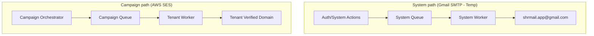

# High-Level Design (HLD) — ShrFlow

This document describes the high-level system architecture, component decomposition, data models, security boundaries, and operational workflows for the **ShrFlow** email operations platform.

---

## 1. System Architecture Overview

ShrFlow is a self-hosted, multi-tenant email marketing and transactional email platform. The system is designed around a **containerized, event-driven, decoupled microservices architecture** that prioritizes high-throughput email sending, secure multi-tenant isolation, and operational calm under heavy loads.

### Architecture Diagram

```
                       ┌─────────────────────────────────────────────────────┐
                       │               Next.js Frontend Client               │
                       │           (Next.js 14 · Tailwind · shadcn)          │
                       └───────────┬─────────────────────────▲───────────────┘
                                   │ REST APIs               │ WebSockets (Progress)
                                   ▼                         │
                       ┌─────────────────────────────────────┴───────────────┐
                       │                   FastAPI Backend                   │
                       │             (Python 3.11 · Async · Uvicorn)         │
                       └───────────┬──────────────┬──────────────┬───────────┘
                                   │              │              │
        ┌──────────────────────────▼┐      ┌──────▼───────┐      │
        │    PostgreSQL Database    │      │   RabbitMQ   │      ▼
        │ (Row-Level Security - RLS)│      │(Message Bus) │  ┌──────────────┐
        └───────────────────────────┘      └──────┬───────┘  │  Redis Cache │
                                                  │          │  & Pub/Sub   │
                                           ┌──────▼───────┐  └──────────────┘
                                           │ Async Workers│
                                           │(Python/Celery│
                                           └──────┬───────┘
                                                  │
                                   ┌──────────────┴──────────────┐
                                   ▼                             ▼
                        [ SMTP / Gmail (Temp) ]             [ AWS SES ]
                            (System Emails)             (Campaign Emails)
```

---

## 2. Core Components & Responsibilities

### 2.1. Frontend Client (`platform/client`)
*   **Tech Stack:** Next.js 14 (App Router), TypeScript, Tailwind CSS, shadcn/ui.
*   **Key Responsibilities:**
    *   **Workspace & Identity:** Provides tenant switcher and handles login, registration, and invitation acceptance flows.
    *   **Contacts Portal:** Import CSVs, manage list filtering, tag users, and inspect suppression lists.
    *   **Campaign Wizard:** Handles campaign configuration, scheduling, and live monitoring.
    *   **Template Builder:** MJML-backed drag-and-drop or block composition layout engine that compiles into clean, responsive HTML.
    *   **Real-time Monitoring:** WebSocket client that displays background job progress (e.g., CSV imports).

### 2.2. Backend API Gateway (`platform/api`)
*   **Tech Stack:** FastAPI, Python 3.11, `asyncio`, Uvicorn.
*   **Key Responsibilities:**
    *   **Authentication & AuthZ:** Custom JWT validation carrying `user_id`, `tenant_id`, and `role`. Handles route guards.
    *   **Workspace Management:** Generates team invitations, performs active-tenant switching validation.
    *   **Job Dispatching:** Triggers background campaigns by pushing cursor-streamed task segments onto RabbitMQ.
    *   **S3/Object Storage Presigned URLs:** Authorizes direct-to-storage file uploads.

### 2.3. Asynchronous Workers (`platform/worker`)
*   **Tech Stack:** Python async workers.
*   **Key Responsibilities:**
    *   **Data Import Workers:** Parsers that stream large CSV/XLSX contact lists, validate structure, MX records, and perform database upserts.
    *   **Campaign Dispatch Workers:** Compiles MJML templates, aggregates variables, checks the Redis kill-switch, applies tenant-specific rate-limiting, and routes payloads to AWS SES.

### 2.4. Message Broker (`RabbitMQ`)
*   **Role:** High-throughput, persistent asynchronous task queue.
*   **Queues:**
    *   `system_emails`: High-priority queue for transactional mail (OTPs, resets).
    *   `campaign_emails`: Throttled, fair-use queue for marketing campaigns.
    *   `import_tasks`: Task queue for large audience processing.
*   **Quality of Service (QoS):** Enforces a **Pre-fetch** of 10 tasks per worker to distribute processing power equitably across active campaigns and prevent head-of-line blocking.

### 2.5. Cache & Coordination Layer (`Redis`)
*   **Role:** In-memory store used for caching, rate limiting, and pub/sub messaging.
*   **Key Responsibilities:**
    *   **WebSocket Gateway Coordination:** Broadcasts background task completion events from workers to active client UI sockets.
    *   **Redis Kill Switch:** Global flag database that immediately stops campaign dispatches when a tenant clicks "Pause".
    *   **Rate Limiting:** Enforces hourly/daily limits per tenant and controls login endpoint security.

### 2.6. Database Layer (`PostgreSQL`)
*   **Role:** Relational storage.
*   **Tenancy Security:** Implements database-level **Row-Level Security (RLS)**.

---

## 3. Database Schema & Indexing Strategy

To maintain scalability when storing hundreds of millions of events, the database is optimized using range-based partitioning and query-specific indexing.

### 3.1. Database Indexing Layout
Indexes are designed to guarantee sub-second retrieval times on core operational routes:
*   `contacts(tenant_id, email)`: Enforces uniqueness per workspace and handles contact deduplication.
*   `email_tasks(status, scheduled_at)`: Optimizes background workers executing campaign dispatches.
*   `campaigns(tenant_id, status)`: Powers dashboard listings and tenant campaign list views.
*   `audit_logs(tenant_id, timestamp)`: Facilitates quick compliance searches.
*   `email_events(campaign_id, contact_id)`: Speeds up aggregate campaign reports.
*   `sender_identities(verification_token)`: Secures verification token lookups.

### 3.2. Event Data Partitioning
*   **Problem:** Campaign interactions generate millions of rows in `email_events`, degrading index performance over time.
*   **Solution:** The `email_events` table is partitioned using **PostgreSQL Range Partitioning** (`PARTITION BY RANGE (occurred_at)`).
*   **Auto-Partitioning CRON:** A scheduled database function generates chronological partition tables monthly (e.g., `email_events_2026_06`), and queries target specific partitions to prune unused indexes automatically.

---

## 4. API Gateway & Integrations Layer

The API gateway manages secure communication with both internal clients and external services.

### 4.1. Inbound REST API & Webhooks Ingestion
*   **Interactive Documentation:** Exposes live OpenAPI/Swagger schemas.
*   **CRM Integrations:** Open REST routes allow external CRMs or lead forms to ingest contacts in real time (`POST /v1/contacts`).
*   **Low-Latency Authentication:** Inbound API keys are validated using a cached hash dictionary inside Redis to eliminate SQL roundtrips on high-volume inbound hooks.

### 4.2. Outbound Webhook Dispatcher
*   **Event Publisher:** Automatically broadcasts events (`email.delivered`, `email.opened`, `email.clicked`, `email.bounced`, `email.complained`, `contact.unsubscribed`) to registered third-party endpoints.
*   **Security Signatures:** Webhook payloads include two headers to verify authenticity and prevent replay attacks:
    *   `ShrFlow-Signature`: The HMAC-SHA256 signature generated using a unique endpoint secret.
    *   `ShrFlow-Timestamp`: The Unix timestamp of the event dispatch (validated against a 5-minute replay window).

---

## 5. Tenancy & Data Isolation (Row-Level Security)

ShrFlow operates under a **shared-database, shared-schema** model. Data from all tenants resides in the same database tables, but data boundaries are strictly isolated using PostgreSQL RLS.

### Transaction-Scoped Isolation Flow

```
[API Request with JWT] ──► [Extract tenant_id] ──► [Connection Pool (asyncpg)] 
                                                               │
                                                               ▼
[Postgres RLS Filters Applied] ◄── [Set Local Transaction Context]
```

1.  **Extract JWT Context:** The API gateway extracts the `tenant_id` from the request JWT headers.
2.  **Transaction Initialization:** The connection pool (`asyncpg`) retrieves a connection and immediately executes:
    ```sql
    SET LOCAL app.current_tenant_id = 'tenant-uuid';
    ```
3.  **RLS Evaluation:** When database queries run, the PostgreSQL engine filters rows according to the table's tenant policy:
    ```sql
    CREATE POLICY tenant_isolation_policy ON campaigns
    USING (tenant_id = current_setting('app.current_tenant_id')::uuid)
    WITH CHECK (tenant_id = current_setting('app.current_tenant_id')::uuid);
    ```
    If `app.current_tenant_id` is empty or incorrect, the database returns empty results, preventing application bugs from exposing cross-tenant data.

---

## 6. Role-Based Access Control (RBAC)

Every request within a workspace is verified against granular role permissions. Roles are stored in `tenant_users`.

| Feature / Permission | Owner | Admin | Creator | Viewer |
| :--- | :---: | :---: | :---: | :---: |
| **Workspace Settings & Billing** | ✅ | ❌ | ❌ | ❌ |
| **Delete Workspace** | ✅ | ❌ | ❌ | ❌ |
| **Invite & Manage Members** | ✅ | ✅ | ❌ | ❌ |
| **Export Contacts / Lists** | ✅ | ✅ | ❌ | ❌ |
| **Send/Trigger Campaigns** | ✅ | ✅ | ❌ | ❌ |
| **Create/Edit Templates** | ✅ | ✅ | ✅ | ❌ |
| **View Analytics & Dashboards** | ✅ | ✅ | ✅ | ✅ |

### Enforcement Architecture
*   **Backend Enforcer:** API routes use FastAPI dependencies (e.g., `require_permission("campaign:send")`) to decode the JWT context, matching the active tenant user's role against a rigid permission-to-role database dictionary.
*   **Frontend Enforcer:** The global Next.js layout exposes a `can(user, action)` utility mapping to conditional rendering structures, disabling or hiding buttons for unauthorized users.

---

## 7. Dual-Path Email Deliverability Engine

To safeguard sender reputation and guarantee immediate transactional delivery, email sending paths are physically and logically segregated.



### 7.1. System / Transactional Flow
*   **Purpose:** OTPs, team invites, and password resets.
*   **Route:** Shared system credentials utilizing `shrmail.app@gmail.com` via **Gmail SMTP** (Temporary solution for development/testing).
*   **Production Migration Path:** The Gmail SMTP route is temporary due to Gmail's daily sending limits (~2,000 emails/day limit on Workspace). The production configuration will migrate system emails to AWS SES (`mail.shrflow.app`).
*   **Advantage:** Fast, guaranteed inbox landing with high default trust for critical notifications during development.

### 7.2. Campaign / Marketing Flow
*   **Purpose:** Newsletters, promotional bulk emails.
*   **Route:** Sent via **AWS SES** using custom domain identities verified by the tenant (e.g., `promos.tenant.com`).
*   **Isolation:** Sender reputation resides with the tenant domain. A spam complaint against one tenant does not degrade the reputation of another tenant or the platform's transactional SMTP.
*   **Reputation Loop:** Automated SNS handlers consume AWS bounce and complaint webhooks, instantly updating the tenant's suppression list to block future sends to problematic addresses.

### 7.3. Rate Limiting & Warmup Throttling
*   **Token Bucket Rate Limiter:** A Redis-backed token bucket (`tenant:{id}:send_tokens`) tracks campaign sending rates according to the workspace plan. The worker checks this bucket before sending any email.
*   **Warmup Automation:** Outbound rates for new verified domains are incrementally increased over a 30-day window to build trust with ISP inbox filters.
*   **Bounce Classification Handler:** Bounces are classified dynamically:
    *   *Hard Bounces:* (`MailboxDoesNotExist`, `Permanent`) trigger immediate suppression.
    *   *Soft Bounces:* (`MailboxFull`, `Transient`) are retried up to 3 times over 24 hours with exponential backoffs.

---

## 8. High-Scale Asynchronous Workflows

### 8.1. Audience Contacts Import Workflow
1.  **Initialize (`POST /import/initialize`):** Frontend requests a secure presigned upload URL from AWS S3/MinIO.
2.  **Direct Upload:** The client uploads the CSV/XLSX file directly to Object Storage. This avoids running out of memory on the API server.
3.  **Process Request (`POST /import/process`):** Frontend signals the backend to start import, which enqueues a parsing job to RabbitMQ.
4.  **Worker Streaming:** A worker downloads the file in chunks of **500 rows**. It validates syntax and executes bulk PostgreSQL upserts, preventing large-file OOM conditions.
5.  **Progress updates:** The worker posts progress ratios to Redis Pub/Sub, which is pushed to the client via WebSockets.

### 8.2. High-Volume Campaign Dispatch Workflow
1.  **Immutability Snapshot:** The system duplicates the current template markup and merge tags into a snapshot. This preserves integrity in case the template is edited mid-send.
2.  **Concurrency Protection:** Optimistic locking using integer version increments on campaigns prevents race conditions where admins approve outdated drafts.
3.  **Cursor-Based Querying:** Backend API retrieves recipient IDs using a server-side DB cursor in batches of **1,000**, streaming contacts into RabbitMQ.
4.  **Worker Consumption & Kill Switch:** Workers process recipient items. Before sending, the worker queries Redis to ensure the campaign's kill-switch has not been triggered.
5.  **SMTP Throttling:** Workers enforce recipient ISP rate limits and stagger sends to prevent IP blocks.

---

## 9. Artificial Intelligence & Advanced Analytics Engine

To optimize campaign effectiveness and streamline developer operations, ShrFlow integrates a self-hosted, private AI and analytics pipeline spanning vector databases, developer tool bridging, and deep user-behavior modeling.

### 9.1. Local RAG & Model Context Protocol (MCP) Framework
To ensure strict privacy and allow self-hosted operations without external cloud dependencies, ShrFlow implements a lightweight, two-stage **Local LLM RAG Execution Pipeline** using an on-premise **1.5B Parameter Model** (e.g., Qwen-2.5-1.5B-Instruct running via llama.cpp or Ollama).

#### Local RAG Execution Flow

```
                      ┌─────────────────────────────────┐
                      │        User Query Input         │
                      └────────────────┬────────────────┘
                                       │
                                       ▼
                      ┌─────────────────────────────────┐
                      │     1.5B LLM: Tool Router       │
                      │ (Determines Intent & Tool Args) │
                      └────────────────┬────────────────┘
                                       │ Generates JSON Tool Call
                                       ▼
                      ┌─────────────────────────────────┐
                      │         MCP Server Tool         │
                      │ (Queries DB, pgvector, or Logs) │
                      └────────────────┬────────────────┘
                                       │ Returns Structured JSON Context
                                       ▼
                      ┌─────────────────────────────────┐
                      │     1.5B LLM: Synthesizer       │
                      │ (Translates Context to Answer)  │
                      └────────────────┬────────────────┘
                                       │
                                       ▼
                      ┌─────────────────────────────────┐
                      │     Answer Returned to User     │
                      └─────────────────────────────────┘
```

#### Detailed Execution Steps:
1.  **Intent Parsing & Routing (Stage 1):** The user's query is fed to the local 1.5B model alongside a list of available MCP tool schemas. The model is constrained to generate a structured JSON tool call (e.g., selecting a DB inspector or vector search tool).
2.  **MCP Tool Execution:** The system intercepts the tool call and runs it locally on the **FastMCP Server** (e.g., executing RLS-safe PostgreSQL queries or searching local logs).
3.  **Synthesis & Grounding (Stage 2):** The retrieved raw JSON data is appended to the user's original query. The 1.5B model processes this combined prompt, translating the structured data into a plain-English, grounded response without hallucinations.

### 9.2. Deep RAG Ingestion & Semantic Search
*   **Vector Datastore:** Utilizes `pgvector` or Pinecone to store high-dimensional campaign content and performance embeddings.
*   **Asynchronous Embedding Pipeline:** On campaign completion, a background task extracts successful email subject lines, body copy, and conversion metrics, indexing them in the vector store.
*   **Semantic Search API:** Computes cosine-similarity queries for natural language prompts.
*   **Features:**
    *   **Global AI Assistant Widget:** Floating UI sidebar widget that reads campaign/template history to compose high-performing copy drafts using the Local RAG loop.
    *   **Segment/Filter Generator:** Natural language inputs (e.g., *"Find users in California who clicked our last email"*) are converted directly into contacts database filters.
    *   **Deliverability Explainer Modal:** Explains obscure SMTP bounce and complaint error codes in plain-English with actionable remediation steps.


### 9.3. Advanced Intelligence & Behavioral Automation
*   **Bayesian A/B/n Multi-Armed Bandit Testing:** Dynamically updates recipient sample split ratios based on live open-rate responses to automatically route traffic to the winning subject line.
*   **Machine Learning Send-Time Optimization (STO):** Evaluates rolling 30-day interaction logs to predict and queue campaigns to execute during the peak open-hour of each individual contact.
*   **Sunset Policies (Zombie Purges):** Scheduled workers track engagement signals and flag/suppress inactive subscribers (>90 days inactive) to protect the domain's reputation score.

### 9.4. Token Optimization & Scaling Strategy
To maintain low latency and operational efficiency on local servers:
*   **Token Optimization Strategy:**
    *   *Prompt Pruning:* System instructions are limited strictly to tool schemas and boundaries.
    *   *Vector Ranking:* Semantic search queries limit database retrieval context to the top-K relevant results ($K=3$).
    *   *JSON Compacting:* Unused database columns are stripped, and whitespace is removed from RAG context payloads.
    *   *Context Truncation:* Strict length guards automatically prune older messages when the prompt approaches context limits.
*   **Scaling Strategy:**
    *   *Stateless Inference Nodes:* LLM serving containers (Ollama or vLLM) are scaled horizontally separate from database and web nodes.
    *   *Asynchronous Queueing:* Expensive AI embedding tasks run asynchronously on separate RabbitMQ worker processes, safeguarding transactional delivery streams.
    *   *Quantization:* GGUF/AWQ 4-bit model quantization reduces RAM requirements to ~1.2 GB, enabling deployment on minimal host environments.

